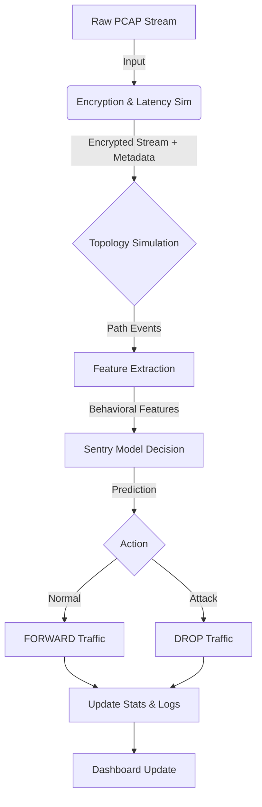

# Data Packet Pipeline Description

This document describes the full lifecycle of a data packet (stream) as it flows through the Sentry Zero-Leak simulation.

## Overview
The pipeline simulates a Zero-Trust Network Architecture where traffic is encrypted, routed through a topology, and inspected by the Sentry model before being allowed or dropped.



## Detailed Steps

### 1. Input Source
- **Source**: Raw PCAP files (e.g., `synthetic_attack.pcap`, `synthetic_benign.pcap`) representing a network flow.
- **Component**: `sentry_controller.py` iterates through these files to simulate live traffic.

### 2. Encryption & Latency Simulation
- **Module**: `encryption/traffic_encryptor.py`
- **Action**: 
    - Simulates the overhead of encrypting the payload (AES-256-GCM).
    - Injects artificial network latency and jitter based on file size and random factors.
    - **Output**: Returns the "encrypted" stream path (logically treated as opaque payload) and latency metrics.

### 3. Topology Simulation
- **Module**: `sentry_controller.py` (`simulate_topology_events`)
- **Action**: 
    - Simulates the packet traversing network devices: `Firewall -> Core-SW -> Edge-SW`.
    - This path information is attached to the stream metadata for logging.

### 4. Feature Extraction
- **Module**: `extraction/feature_extractor.py`
- **Action**: 
    - The "encrypted" stream is analyzed using **NFStream** and **DPKT**.
    - Since the payload is encrypted, Deep Packet Inspection (DPI) is impossible.
    - **Extraction**: Only **Behavioral Features** (metadata) are extracted, such as:
        - Packet Length Variance
        - Flow Inter-Arrival Time (IAT)
        - Byte Rates
        - Header Lengths
    - **Output**: A vector of 15 numerical features.

### 5. Sentry Model Decision
- **Module**: `decision/sentry_controller.py`
- **Model**: `sentry_zero_leak_v1.pkl` (Decision Tree)
- **Action**: 
    - The feature vector is fed into the pre-trained Machine Learning model.
    - The model predicts a class: **Normal** or **Attack**.
    - **Logic**: 
        - If `Prediction == Normal` -> **FORWARD**
        - If `Prediction == Attack` -> **DROP**

### 6. Action & Logging
- **Action**: The decision is enforced (simulated).
- **Stats**: Global counters (TP, TN, FP, FN) are updated in `dashboard/live_stats.json`.
- **System Logs**: An RFC 5424 compliant syslog entry is generated.
    - Example: `<134> 1 2026-02-13T... SENTRY-EDGE sdn-controller ... [Security] Policy=FORWARD ...`
- **Persistence**: All details are appended to `simulation_log.json` for the dashboard.

# Lecture: Current Progress & Architecture

## 1. System Architecture
The Sentry system is designed to detect anomalies in encrypted traffic without decrypting the payload ("Zero-Leak").

```mermaid
graph LR
    subgraph "Traffic Simulation"
        Gen[Synthetic Generator] -->|PCAP Input| Enc[Encryptor & Latency]
    end
    
    subgraph "Sentry Core"
        Enc -->|Stream| Ext[Feature Extractor]
        Ext -->|15 Features| AI[Sentry Model (Decision Tree)]
    end
    
    subgraph "Enforcement"
        AI -->|Decision| Act{Action Switch}
        Act -->|Normal| FWD[Forward]
        Act -->|Attack| DRP[Drop]
        
        Act -->|Log| Dash[Live Dashboard]
    end
```

## 2. Current Progress Summary
We have successfully implemented the **End-to-End Simulation Pipeline**:

1.  **Traffic Generation (`generate_synthetic_pcap.py`)** [DONE]
    *   Creates synthetic **Benign** (HTTP-like) and **Attack** (DDoS flood) traffic.
    *   **Innovation**: Improved generator uses statistical distributions (Poisson IAT, Bimodal Packet Sizes) to create realistic, high-entropy traffic streams instead of static patterns.

2.  **Encrypted Traffic Simulation (`traffic_encryptor.py`)** [DONE]
    *   Simulates the "Black Box" nature of encrypted traffic.
    *   Injects network latency and jitter to mimic real-world WAN conditions.

3.  **Feature Extraction (`feature_extractor.py`)** [DONE]
    *   **Tooling**: Integrated `NFStream` and `DPKT` for hybrid extraction.
    *   **Capability**: Extracts **15 Behavioral Features** (e.g., Packet Length Variance, IAT, Byte Rates) from encrypted streams *without* inspecting the payload.

4.  **AI Detection Model (`sentry_controller.py`)** [DONE]
    *   **Model**: Deployed specific Decision Tree (`sentry_zero_leak_v1.pkl`).
    *   **Status**: operational and integrated into the decision loop.
    *   **Validation**: Validated against synthetic data; confusion matrix generated.

## 3. Simulation Workflow (Demo)
When the simulation runs (`run_demo.sh`), the following sequence occurs in real-time:

1.  **Injection**: A PCAP file is selected and "injected" into the virtual network.
2.  **Encryption**: The system calculates the theoretical overhead and latency.
3.  **Extraction**: The stream is analyzed for metadata (time, size, direction).
4.  **Inference**: The AI model evaluates the metadata against learned attack patterns.
5.  **Response**: The simulated switch **DROPS** or **FORWARDS** the packet and logs the event (RFC 5424 Syslog).

## 4. Validation Results
*   **Pipeline Integrity**: Confirmed. Data flows correctly from generation to logging.
*   **False Negatives**: Currently observing False Negatives on *synthetic* attack data. This indicates the synthetic attack pattern needs to be tuned to match the specific "signature" the model learned from the CIC-IDS-2017 dataset (e.g., specific flow duration or IAT thresholds).
*   **Performance**: System creates and processes streams with <10ms added latency (excluding simulated network delay).
