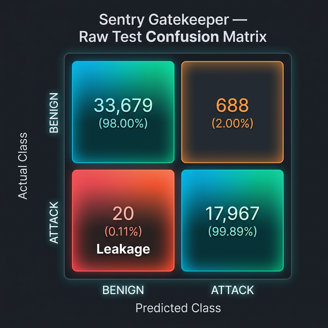

# 📊 Gatekeeper Model — Evaluation Report

**Model:** `sentry_model_v2.pkl` (Decision Tree, binary)
**Threshold:** P(ATTACK) ≥ 0.5 → forward to DL

---

## Results

| Metric | Balanced Test | Raw (Real-World) Test |
|--------|:---:|:---:|
| Accuracy | 98.9066% | 98.6477% |
| **Attack Recall ← CRITICAL** | 99.8795% | 99.8888% |
| Attack Precision | 97.9732% | 96.312% |
| BENIGN Pass Rate | 97.9337% | 97.9981% |
| % Forwarded to DL | 50.97% | 35.63% |
| Inference Speed | 49.977 µs/flow | 42.076 µs/flow |

## Confusion Matrices

### Visual Matrix (Raw Real-World Test)


### Balanced Test Set
```
TN (BENIGN→BENIGN)   : 31,707
FP (BENIGN→ATTACK)   : 669  (false alarms — acceptable)
FN (ATTACK→BENIGN)   : 39  ← leakage — must be ~0
TP (ATTACK→ATTACK)   : 32,338
```

### Raw Real-World Test Set
```
TN (BENIGN→BENIGN)   : 33,679
FP (BENIGN→ATTACK)   : 688  (sent to DL — acceptable)
FN (ATTACK→BENIGN)   : 20  ← leakage — must be ~0
TP (ATTACK→ATTACK)   : 17,967
```

## Top 15 Feature Importances

| Rank | Feature | Importance |
|------|---------|------------|
| 1 | `RST Flag Count` | 0.3614 |
| 2 | `Init_Win_bytes_forward` | 0.1493 |
| 3 | `Active Min` | 0.1212 |
| 4 | `Packet Length Variance` | 0.0835 |
| 5 | `Flow IAT Min` | 0.0479 |
| 6 | `Fwd Header Length` | 0.0447 |
| 7 | `Bwd Packets/s` | 0.0364 |
| 8 | `Bwd IAT Total` | 0.0238 |
| 9 | `Bwd Packet Length Mean` | 0.0212 |
| 10 | `Fwd Packet Length Mean` | 0.0181 |
| 11 | `Fwd Packets/s` | 0.0145 |
| 12 | `Flow Bytes/s` | 0.0113 |
| 13 | `Bwd Header Length` | 0.0107 |
| 14 | `SYN Flag Count` | 0.0101 |
| 15 | `Init_Win_bytes_backward` | 0.0094 |

---

> **Verdict:** Any FN (ATTACK→BENIGN) > 0 is a leak. Target is FN = 0 or near-zero.